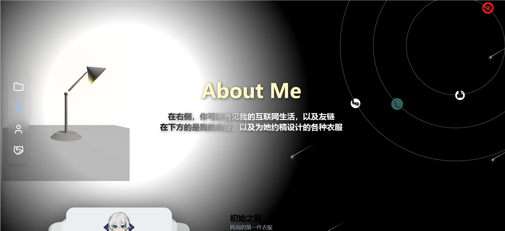
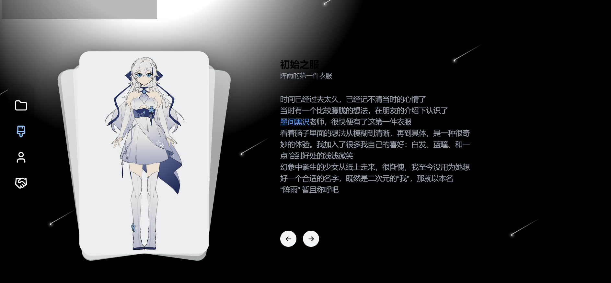
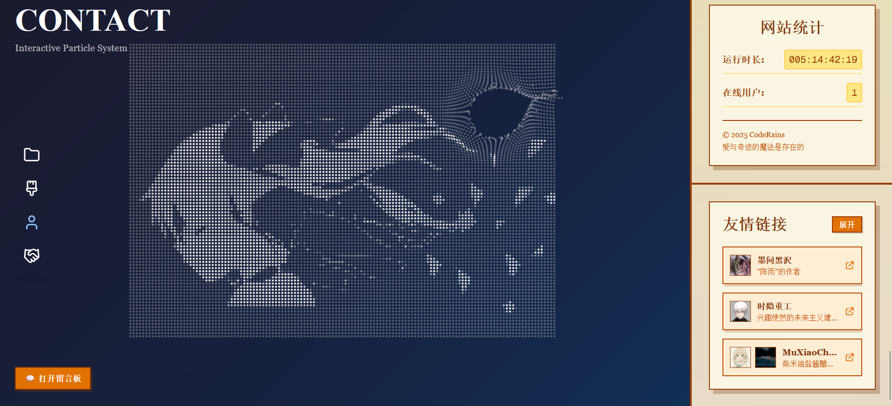
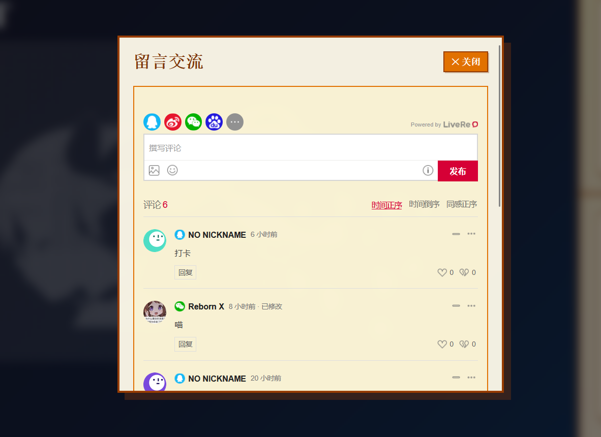

# 晓雨 - CodeRains

> 大家好，欢迎来到晓雨 | CodeRains，一个纯前端的个人网站，也是我的小小休憩之处。
> 欢迎访问 <a href="https://www.coderains.cn" style="color:#e9546b; font-weight:bold; text-decoration:none;">www.coderains.cn</a> 体验。

---

## 技术栈与核心依赖

- **前端框架**：Next.js 15（React 19）
- **主要依赖**：Tailwind CSS 4，<a href="https://ui.aceternity.com/">Aceternity UI</a>，<a href="https://magicui.design/">magic UI</a>，<a href="https://threejs.org/">three.js</a>
- **留言板实现**：<a href="https://livere.com/">Livere 来必力</a>

---

## 网站功能与模块

### 首页动效

首屏模仿手绘效果的加载动画（LoadingCanvas），绘画完成后进入首页，Logo 动态脉冲。

  

  

### 导航栏（Navbar）

- 侧边导航栏，图标根据背景自动切换明暗色，支持平滑滚动定位。
- 拥有定位图标变色、点击放大等效果。

### 项目展示（Projects）

3D 卡片式项目展示，动效丰富，支持标签、分类、点开详情等信息。

  

### 爱好

- 博客碎碎念，左侧有可交互的 three.js 模型。
- 点开查看文章详情。

  

  

### 关于

- 左侧有可交互的台灯 3D 模型，和随之反应的背景。
- 右侧有可交互的行星模型，包含我的各种联系方式。
- 下方有可切换的自设和服设。

  

  

### 友链、留言板

- 有可交互的点阵图，是从我之前的项目改编而来。
- 利用 Livere，实现留言板功能。
- 欢迎交换友链哦！

  - 名称: 晓雨 | CodeRains
  - 链接: <a href="https://www.coderains.cn">https://www.coderains.cn</a>
  - logo: <a href="https://www.coderains.cn/assets/logo/%E6%AD%A3%E6%96%B9%E5%BD%A2.png">https://www.coderains.cn/assets/logo/%E6%AD%A3%E6%96%B9%E5%BD%A2.png</a>
  - 简介: 喵~请抓紧我的手吧
  - 首页截图: <a href="https://www.coderains.cn/assets/siteshot.png">https://www.coderains.cn/assets/siteshot.png</a>

  

  

### 响应式设计

全站自适应，兼容电脑和手机。

